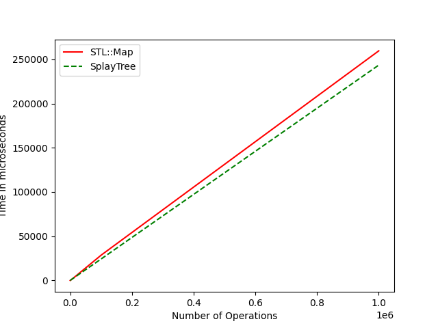
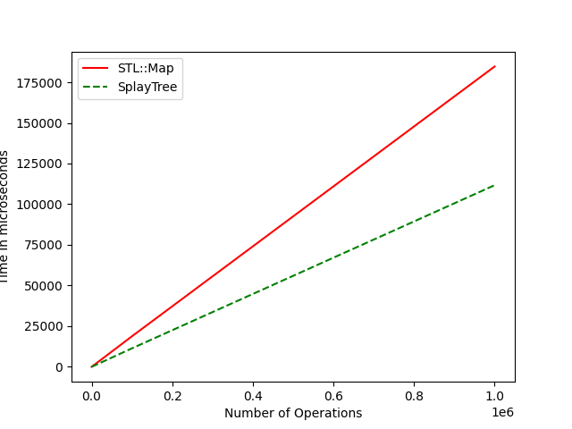

# Splay-Tree as a Container

This project recreates the Map class of the Standard Template Library in C++ using the self-balancing tree data structure Splay Trees. The current version of the container is generic and should work with most datatypes. Apart from implementing a very familiar interface of that of std::map, we also compare the performance of SplayTree to std::map. Most functionality has been added to the container however there is room for improvements and additional functions. 

## How to Compile & Test
<details>
  <summary><b> Linux & Mac </b> </summary>
  
  ### Compilation  
  
  ```shell
  git clone https://github.com/IamShubhamGupto/Splay-Tree-as-a-Container.git
  cd Splay-Tree-as-a-Container
  make clientfile=<ENTER PATH TO CLIENT FILE NAME HERE>
  ./bin/a.out
  ```  

  <b>EXAMPLE </b>
  
  ```shell
  make clientfile=examples/client1.cpp
  ./bin/a.out
  ```
  
  ### Testing  
  
  Prerequiste:
  
  ```shell
  pip3 install matplotlib
  ```
  
  Guide:
  
  ```
Usage: python3 tests/run_test.py [options] {-t | --testtype}

Required for execution:
        -t, --testtype <test types>
                Select type of test to run

        <test types>:

                1 - run insertion, delete and updation test at different number of operations

                2 - run insertion test at at different number of operations

                3 - run deletion test at different number of operations

                4 - run updation test at different number of operations

options:
        -m, --max_ops <maximum operations>
                Maximum number of operations - insertions/updates/deletions to performed.
                Default=1000

        -k, --max_keys <maximum keys>
                Maximum number of unique keys stored in container.
                Default = 100

        -h, --help
                Display Help
  ```
  
  <b>EXAMPLE </b>
  
  ```shell
  python3 tests/run_test.py -t tests/test1.cpp -m 10000 -k 100
  ```
  #### Clean Up
  In order to clean the generated files, run ```make clean```.
</details>  

## Comparison of performance with std::map

  **a**          |  **b**
:-------------------------:|:-------------------------:
  |   
<p align="center">
    Figure 1. Comparison between std::map and SplayTree for time vs operations(1000000) which include insetions/deletions and updates while using a maximum of (a). 100 unique keys, (b). 10 unique keys.
</p>

## Member Types
| <b> Member Type </b>    | <b> Definition </b>                               |
| -------------           | -------------                                     |
| key_type                | template type of the key in the pair              |
| mapped_type             | template type of the value in the pair            |
| root_                   | stores root node of the splay tree.               |
| iterator                | a bidirectional iterator to mapped_type.          |
| const_iterator          | a bidirectional iterator to constant mapped_type. |
| reverse_iterator        | a bidirectional iterator to mapped_type.          |
| const_reverse_iterator  | a bidirectional iterator to constant mapped_type. |

## Member Functions


| <b> Member Function </b>    | <b> Definition </b>                           |
| -------------           | -------------                                     |
| (constructor)           | Splay tree constuctor.                            |
| (destructor)            | Splay tree destructor.                            |
| operator=               | Copy container contents.                          |
|               |                         |
| <b> Iterators </b>      |                                   |
|               |                         |
| begin                   | Return iterator to first in-order element.               |
| end                     | Return iterator to beyond-the-last element.              |
| cbegin                  | Return a constant iterator to first in-order element.    |
| cend                    | Return a constant iterator to beyond-the-last element.   |
| rbegin                  | Return iterator to last in-order element.                |
| rend                    | Return iterator to beyond-the-first element.             |
| crbegin                 | Return a constant iterator to last in-order element.     |
| crend                   | Return a constant iterator to beyond-the-first element.  |
|               |                         |
| <b> Element Access </b> |                                                       |
|                         |                         |
| operator[]              | Access element using key. If not present, (default) value is inserted.      |
| at                      | Access element using key. If not preseed, out_of_range exception is thrown. |
|                         |                                                                             |
| <b> Modifiers </b>      |                                                                                                                               |
|                         |                                                                                                                               |
| insert                  | Insert new key-value pair into the tree. Incase key already exists, update value and return an iterator to inserted element.  |
| erase                   | Delete a key-value pair based on key. If key does not exist, do nothing.                                                      |
| clear                   | Free the entire splay tree.                                                                                                   |
|                         |                                                                                                             |
| <b> Operations </b>     |                                                                                                             |
|                         |                                                                                                             |
| find                    | Search for a key-value pair based on a given key. Return an iterator to pair if found else return end()     |
| printTree               | Visually print the splay tree.                                                                              |

### By
- [Shubham Gupta](https://github.com/IamShubhamGupto)
- [Shubham Kumar](https://github.com/shubham2k)

Special thanks to [Faraz](https://github.com/farazzshaikh) , [Reuben](https://github.com/iamrgm) and [Madhoolika](https://github.com/madhoo29) for testing the container during the early stages of the project 😄

### License
This work is licened under [GPL v3.0](LICENSE).
